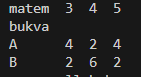
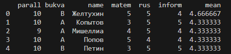
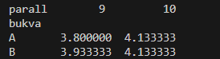

# School_magazine

## Оглавление

* [Описание проекта](#описание-проекта)
    * [Основные возможности](#основные-возможности)
    * [Как это работает?](#как-это-работает)
    * [Предварительные требования](#предварительные-требования)
    * [Установите зависимости](#установите-зависимости)
* [Скрипты проекта](#cкрипты-проекта)
* [Готовое решение](#готовое-решение)
    * [decision.py](#decisionpy)
* [Шаги уроков](#шаги-уроков)
    * [lesson_steps.py](#lessonstepspy)
* [Цель проекта](#цель-проекта)

## Описание проекта

School_magazine - это проект созданный для отслеживания успеваемости учеников.

### Основные возможности

1. Позволяет получить журнал с отметками учеников.
2. Позволяет получить среднюю успеваемость по классам паралелей.
3. Позволяет получить список n лучших учеников.
4. Позволяет получить количество оценок у каждой паралели.

### Как это работает?

Проект основан на использовании библиотеки Pandas. Перед работай потребуется сделать небольшое количество работ, чтобы его запустить, но что у вас получится обрадует вас.

Основной акцент делается на получении журнала учеников.

### Предварительные требования:

1. Установленный Python версии 3.11 и выше.
2. pip - установщик пакетов Python.

### Установите зависимости

С активированным виртуальным окружением установите зависимости проекта:

```bash
pip install -r requirements.txt
```

## Скрипты проекта:

* [decision.py](#decisionpy)
* [lesson_steps.py](#lessonstepspy)

## Готовое решение

### decision.py

#### Что делает скрипт?

Скрипт имеет несколько функций:

1. create_klass_jurnal - создаёт журнал класса с рандомными оценками.
2. class_jurnal - возращает n количество лучших учеников и количество оценок по математике(можно и по другим предметам)
3. analysis_performance - возращает средние оценки по паралелям.

#### Как запустить скрипт?

```bash
python decision.py
```

#### Что выведет скрипт?

Если все зависимости установлены и код не деформирован то всё получится.

Пример запуска и вывода :

```
C:\Users\User> cd \Desktop\*Папка с проектом*
C:\Users\User\Desktop\*Папка с проектом*> pip install -r requirements.txt
C:\Users\User\Desktop\*Папка с проектом*> python decision.py
```

В этом примере мы запускаем файл `decision.py`.

Переменная `result`



Переменная `top`



Переменная `result_analysi`



Скрипты можно изменять:

1. Функция class_jurnal принимает 3 переменных и одна из них column в неё можно записать кроме `bukva`, можно записать ещё `parall` и `['bukva', 'parall']`

2. Функция class_jurnal имеет переменную result и в нем есть `columns` и в него можно записать переменные из списка `subjects`

## Шаги уроков

Следующий файл содержит все скрипты, что были написаны во время урока.

### lesson_steps.py

Этот файл содержит все скрипты, которые требовались во время урока, но не вошли в основной файл.

## Цель проекта

Проект написан в образовательных целях платформы Devman.